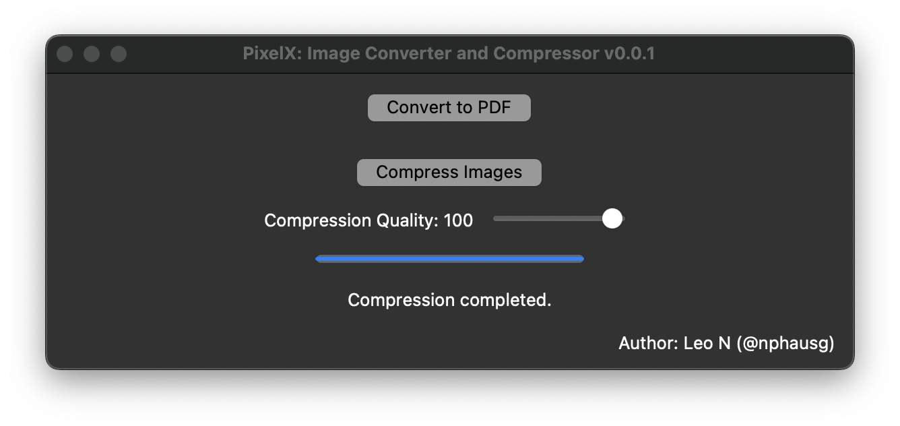

<h1 align="center"> Images to PDF Converter </h1>

<div align="center">
    
</div>


## 👉 Overview

The Image to PDF Converter is a simple Python application that allows users to convert multiple images into a single PDF file. It provides a graphical user interface (GUI) built using the Tkinter library, making it easy for users to select a folder containing images and generate a PDF document from them. The application supports various image formats such as JPG, JPEG, PNG, GIF, and BMP. Additionally, it maintains the aspect ratio of the images within the PDF file to ensure accurate representation.

 

### 🚀 Key Features:

- **Select Folder**: Users can select a folder containing images using a file dialog.

- **Convert Images**: The application converts all images in the selected folder into a single PDF document.

- **Maintain Aspect Ratio**: Images maintain their aspect ratio within the PDF file to preserve their original appearance.

- **Display Status**: The GUI displays status messages to inform users about the conversion process and the location of the generated PDF file.

- **Calculate Total Files Size**: Optionally, the application calculates and displays the total size of all files in the selected folder before converting them to PDF.

## 🚀 How to use

Cloning the repository into a local directory and checkout the desired branch:

```
git clone git@github.com:nphausg/images2pdf.git
git checkout master
source .venv/bin/activate
.venv/bin/python images2pdf.py
```
1. Run the Python script image_to_pdf_converter.py.
2. Click the "Select Folder" button to choose a folder containing images. Once a folder is selected, the application converts the images into a PDF file and displays the status message. *Optionally, users can view the total size of all files in the selected folder before conversion*.

## 🚀 How to distribute

### Dependencies

- Python 3.x
- Tkinter
- reportlab
- Pillow

### Distribution

- **Step 1**: Install PyInstaller, If you haven't already installed PyInstaller, you can do so using pip: pip install pyinstaller

- **Step 2**: Prepare Your Python Script. Make sure your Python script (image_to_pdf_converter.py) is ready for distribution. Ensure it includes all necessary dependencies and functionality.

- **Step 3**: Run PyInstaller, Navigate to the directory containing your Python script in the command line and run PyInstaller with your script as an argument:

    ```python
    pyinstaller image_to_pdf_converter.py
    ```

- **Step 4**: Test the Executable. Navigate to the dist directory and run the generated executable to test it:
    - On Windows: Run image_to_pdf_converter.exe
    - On macOS: Run image_to_pdf_converter
    - On Linux: Run ./image_to_pdf_converter

    Make sure the executable behaves as expected and includes all required functionalities.

- **Step 5**: Distribute Your Executable

    You can distribute your executable by sharing the generated file (image_to_pdf_converter.exe on Windows, image_to_pdf_converter on macOS and Linux). Users can run it directly without needing Python or any additional dependencies installed.

## 🍲 Screenshots

### Images to PDF


 

### PixelX

 

## ✨ Contributing

Contributions to this project are welcome. Feel free to submit issues, suggest improvements, or create pull requests.

## ✨ Acknowledgments:
Special thanks to the developers of the Tkinter, reportlab, and Pillow libraries for providing the tools necessary to build this application.


## 👀 Author

<p>
    <a href="https://nphausg.medium.com" target="_blank">
    
    </a>
</p>
